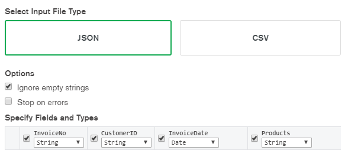

# Polyglot Databases

## Getting Started:

**FIRST** [download the populate files here](https://mega.nz/file/65gzTCza#k_2PVPlsA7E0SuTiez5vKr1mIu91ay6AfSsWXp1LzFc)

### Setting up Postgres:

-   Create two databases. `db_exam_logistics` and `db_exam_customers`.
-   Download the DDL files [located here](https://github.com/DBois/db_exam_commerce/tree/master/postgres).

#### Setting up Logistics database

-   Download the CSV files mentioned above
-   Select your logistics database
-   Import the scripts inside `Postgres\Logistics` in the order they are named.

#### Setting up Customer database

-   Download the CSV files mentioned above
-   Select your customer database
-   Import the scripts inside `Postgres\customer` in the order they are named.

#### Setting up Roles, Functions and Triggers

-   Take the `db_combined_roles.sql` and copy and run, the content into a new SQL editor, to setup users and roles.
-   Take the `create_functions_procedures_triggers_customer.sql` and copy and run, the content into a new SQL editor on the customer database.
-   Take the `create_functions_procedures_triggers_logistics.sql` and copy and run, the content into a new SQL editor on the logistics database.

### Setting up MongoDB

-   Download the CSV files mentioned above
-   Download [Compass](https://www.mongodb.com/products/compass)
-   Setup your database and create a new collection
-   On the top bar press Collection -> Import Data and use the following settings (**InvoiceDate: Date**):  
    
-   To setup the roles, login to your mongoDB admin account.
-   Switch to the admin database by typing `use admin`
-   Copy paste the roles and users from [this file](./mongodb/mongo_users_and_roles.js)
-   **If you do not have authorization enabled do the following:**
-   Locate your `mongod.cfg` file. Mine was inside `C:\Program Files\MongoDB\Server\4.2\bin` and add the following lines:

```
security:
  authorization: "enabled"
```

-   Restart your MongoDB service:  
    **For windows:**
-   Search for Services.msc and open it.
-   Right click on MongoDB Server and Restart  
    **For Linux:**
-   Write `sudo service mongod restart` in the console

### Setting up Neo4j

-   Create database (we used 3.5.17)
-   Place 2_product.csv in import folder
-   Load in csv

```
LOAD CSV WITH HEADERS
FROM "file:///2_product.csv"
AS Line
CREATE (c:Product {ProductNo: Line.product_number})
```

-   In-order to set-up the users and roles execute the following commands, one by one.

```
CALL dbms.security.createUser('admin_user', 'dbois', false);
CALL dbms.security.addRoleToUser('admin', 'admin_user');

CALL dbms.security.createUser('reader_user', 'dbois', false);
CALL dbms.security.addRoleToUser('reader', 'reader_user');
```

### Setting up redis cluster

_For this project we've used redis version 5+ which is required for using the following instructions. Otherwise go to this [redis cluster tutorial](https://redis.io/topics/cluster-tutorial), see how it differs for 3+ and 4+_

This is quick guide to how we set our redis clusters up. For further explanations read the aforementioned link.

#### Requirements

-   unix system/subsystem
-   redis-cli 5+

#### Steps

1. Make folders for cluster and then make folders for each port you want to run a redis-server application on. In our case 3 masters and 3 slaves so folders 7000-7005

```shell
mkdir redis-cluster
cd redis-cluster
mkdir 7000 7001 7002 7003 7004 7005
```

2. **REMEMBER TO UPDATE PORT TO CORRESPONDING FOLDER YOU'RE IN**  
   In each of the 7000-7005 folders make a redis.conf file which consists of the following text.

```shell
port 7000
cluster-enabled yes
cluster-config-file nodes.conf
cluster-node-timeout 5000
appendonly yes
```

3. Download newest git repo of [unstable branch of redis ](https://github.com/antirez/redis)

```git
cd <file path to your redis-cluster folder>
git clone https://github.com/antirez/redis

```

4. Make executable of this source code

```
sudo apt-get update
sudo apt-get install tcl
cd redis
make
make test
```

5. After `make test` open a terminal in each of the 7000-7005 folders and run the following command

```
../redis/src/redis-server ./redis.conf
```

6. Now you have the nodes ready to make a cluster. Run the following command to create the cluster:

```
redis-cli --cluster create 127.0.0.1:7000 127.0.0.1:7001 127.0.0.1:7002 127.0.0.1:7003 127.0.0.1:7004 127.0.0.1:7005 --cluster-replicas 1
```

## Endpoint documentation

Default url: localhost:5000

### /shopping_cart

 <table style="width:100%">
  <tr>
    <th>Method</th>
    <th>Required body</th>
    <th>URL params</th>
    <th>Description</th>
  </tr>
  <tr>
    <td>GET</td>
    <td></td>
    <td>?user_id=userid123</td>
    <td>Get shoppingcart based on user ID</td>
  </tr>
  <tr>
    <td>POST</td>
    <td>{user_id:"userid123",<br/>product_no:"00004",<br/>qty:4}</td>
    <td></td>
    <td>Adds product to shopping cart</td>
  </tr>
  <tr>
    <td>DELETE</td>
    <td>{user_id:"userid123",<br/>product_no:"00004"}</td>
    <td></td>
    <td>Deletes product in shopping cart</td>
  </tr>
</table>

### /order

 <table style="width:100%">
  <tr>
    <th>Method</th>
    <th>Required body</th>
    <th>URL params</th>
    <th>Description</th>
  </tr>
  <tr>
    <td>POST</td>
    <td>{user_id:"userId123"}</td>
    <td></td>
    <td>Makes an order based on the shopping cart the user_id has in redis</td>
  </tr>
  <tr>
    <td>GET</td>
    <td></td>
    <td>/popular_products</td>
    <td>Fetches most popular products given the last month </td>
  </tr>
  <tr>
    <td>POST</td>
    <td>{days:30}</td>
    <td>/popular_products</td>
    <td>Business endpoint. Updates the most post popular products based on specified amount of days</td>
  </tr>
</table>

### /recommended_products

 <table style="width:100%">
  <tr>
    <th>Method</th>
    <th>Required body</th>
    <th>URL params</th>
    <th>Description</th>
  </tr>
  <tr>
    <td>GET</td>
    <td></td>
    <td>?product_no=</td>
    <td>Retrieves a list of the 10 most bought products someone has bought with the product you send in</td>
  </tr>
</table>

## Users

### Postgres

| Username       | Password | Description                                                                                                                                                                                                 |
| -------------- | -------- | ----------------------------------------------------------------------------------------------------------------------------------------------------------------------------------------------------------- |
| admin_user     | admin    | Has all Privilages on all tables and sequences                                                                                                                                                              |
| read_only_user | readonly | Can select on all tables                                                                                                                                                                                    |
| cs_user        | cs       | **Customer Support:**<br> Can insert, select and update on all tables in customer<br> Can select on product table<br> Can select on restock logfile                                                         |
| hr_user        | hr       | **Human Resources:**<br> Can select on department table<br> Has all privilages on employee and job table                                                                                                    |
| dm_user        | dm       | **Department Manager:**<br> Has all privilages on department product table<br> Can select and update on department table<br> Can insert and select on product table<br> Can select on restock logfile table |

### Mongo

### Neo4j

### Redis
